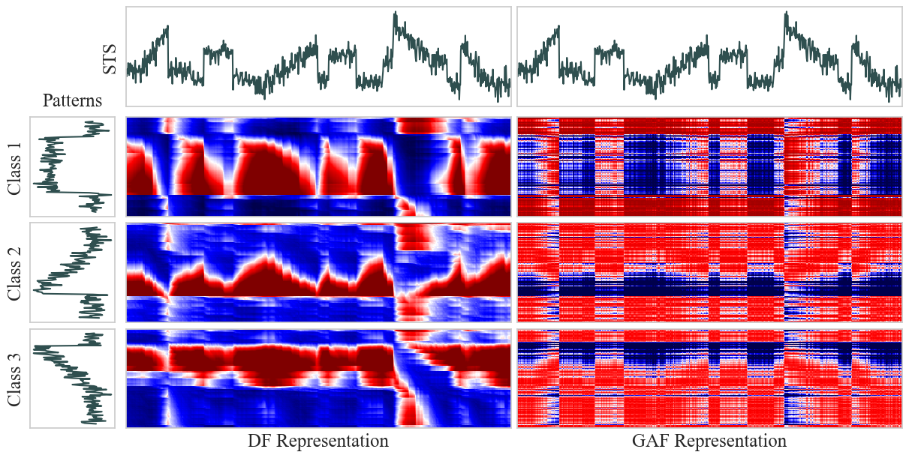
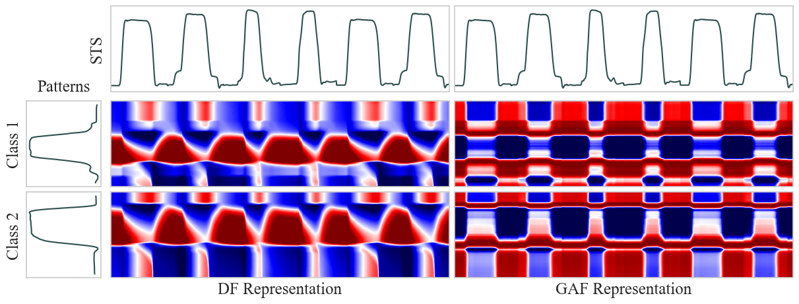
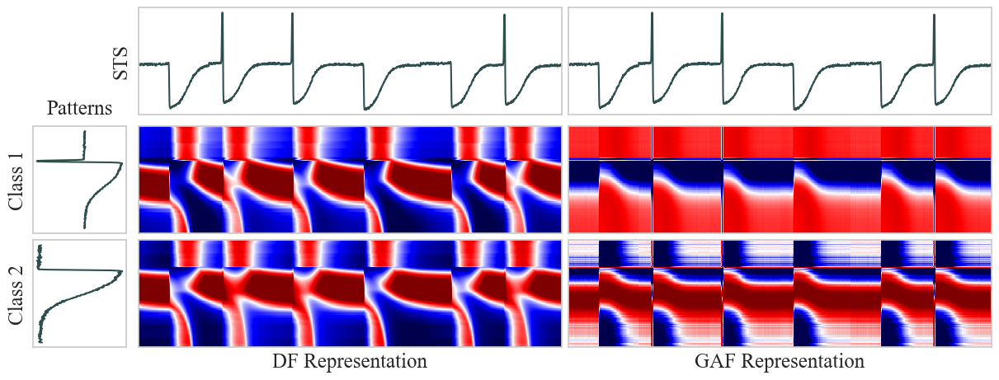

# Self-Supervised Streaming Time Series Classification

This repository contains the code for the paper **"Streaming time series classification via self-supervised image representations"** during the submission process to the International Conference on Data Mining (ICDM) 2023.

## Abstract

Streaming time series (STS) may be seen as concatenations of regular time series (TS) events that are received in a point-by-point basis. In a realistic setting, there is a continuous stream of data and only a few labeled events to tackle the classification problem. Recently, the dissimilarity frame (DF) feature representation has been proposed to deal with STS classification. DFs transform the STS into a sequence of images that can be classified by standard CNN image classifiers. We devised an adaptation to the STS setting of another popular image-based encoding, Gramian angular fields (GAF), by following the pattern-projection scheme used in the DF representation. We propose a self-supervised pretraining strategy for image-based STS classifiers, enabling the exploitation of unlabeled data from the STS data stream. We also put forward an optimization for image-based classifiers that enables the extraction of longer time features with no additional computational cost. Our experiments show that both methodologies either match or surpass the performance of state-of-the-art STS classifiers that utilize the raw data directly.

## Image Encodings

<p align="center">
 </br>
 </br>
 </br>
<em>DF (left) vs GAF (right) encoding of several datasets. In order: CBF, GunPoint, Trace.</em>
</p>

## Replication

In this section we detail the steps to replicate the experiments of the paper.

### Environment Setup

In order to setup the environment, we recommend using a virtual environment. The following commands will create a python virtual environment and install the dependencies.

```bash
git clone https://[repository_url]/s3ts.git     # clone the repo
cd s3ts                                         # move in the folder
python3 -m venv s3ts_env                        # create virtualenv
source s3ts_env/bin/activate                    # activate it
pip install -r requirements.txt                 # install dependencies
python -m pip install -e .                      # install s3ts package
```

### Running the Experiments Locally

There are several ways to run the experiments. The easiest way to replicate all the paper's results locally is to run the script 'run_local.py' with the following command:

```bash
python run_local.py
```
By default, this script will run all the experiments in series (which takes a long time). It comes with several options to run only a subset of the experiments, or to run them with different parameters. There is also a CLI script, 's3ts/cli.py' to run individual experiments from the command line. For examples, to train the DF, CNN-based classifier on the GunPoint dataset, run the following command:

```bash
python s3ts.cli --dataset GunPoint --mode df --arch cnn
```

Several more seetings are available in the script's help display, accessible with the following command:

```bash
python s3ts.cli --help
```

### Running the Experiments on a Cluster

The experiments can also be run in parallel on an HPC cluster using the SLURM scheduler using the 'run_sbatch.py' script. It has the same settings as the 'run_local.py' script, but it will submit each experiment as a separate job to the cluster. It requires the user to specify the path to the python virtual environment to use on the cluster.

Assuming the environment is loaded, the following command will submit all the experiments to the cluster:

```bash
python run_sbatch.py
```

### Reproducing the Analysis and Figures

The analysis and figures of the paper can be reproduced by running the 'analysis.ipynb' notebook. By default, it will load the results of the experiments from the 'storage/results' folder.


